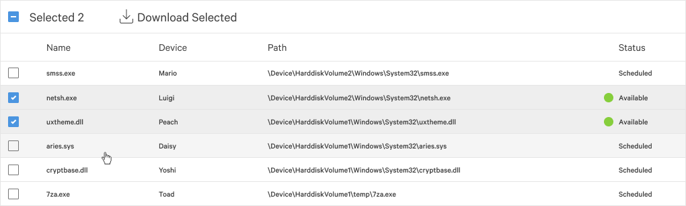

# File Table React Component



## Requirements:
- Only those that have a status of "available" are currently able to be downloaded. Your implementation should manage this.
- The select-all checkbox should be in an unselected state if no items are selected.
- The select-all checkbox should be in a selected state if all items are selected.
- The select-all checkbox should be in an indeterminate state if some but not all items are selected.
- The "Selected 2" text should reflect the count of selected items and display "None Selected" when there are none selected.
- Clicking the select-all checkbox should select all items if none or some are selected.
- Clicking the select-all checkbox should de-select all items if all are currently selected.
- Status should be correctly formatted
- Clicking "Download Selected" when some or all items are displayed should generate an alert box with the path and device of all selected files.
- Precise/exact HTML formatting/styling to match the mockup is not required however rows should change colour when selected and on hover.

This component displays a list of files which can be downloaded. It should be able to be given the following data:

```
[
  {
    "name": "smss.exe",
    "device": "Mario",
    "path": "\Device\HarddiskVolume2\Windows\System32\smss.exe",
    "status": "scheduled"
  },
  {
    "name": "netsh.exe",
    "device": "Luigi",
    "path": "\Device\HarddiskVolume2\Windows\System32\netsh.exe",
    "status": "available"
  },
  {
    "name": "uxtheme.dll",
    "device": "Peach",
    "path": "\Device\HarddiskVolume1\Windows\System32\uxtheme.dll",
    "status": "available"
  },
  {
    "name": "aries.sys",
    "device": "Daisy",
    "path": "\Device\HarddiskVolume1\Windows\System32\aries.sys",
    "status": "scheduled"
  },
  {
    "name": "cryptbase.dll",
    "device": "Yoshi",
    "path": "\Device\HarddiskVolume1\Windows\System32\cryptbase.dll",
    "status": "scheduled"
  },
  {
    "name": "7za.exe",
    "device": "Toad",
    "path": "\Device\HarddiskVolume1\temp\7za.exe",
    "status": "scheduled"
  }
]
```

## Design Considerations
- A generic table is a very commonly used component but also fairly complex. I decided to mainly lean into this component for this assignment.
  - Generics are used throughout to allow for any object like data to be used
  - Allows for user provided table actions
  - An optional render function can be set which will allow for calculated columns or custom styling
  - *In the future it would be possible to add additional features like column sorting or user configurable columns
- An ID is generated each row so that it can be used in event handlers. It also is used as a react key which would allow for features like table sort.
- The design does not specify how the UI should handle downloading only `available` items. There are a few ways that this could be handled.
  1. The scheduled rows could have disabled checkboxes (but that does not seem to be the case in the screenshot)
  1. The button could be disabled if you selected items which would be invalid
  1. The button could filter the incoming data and only act on valid rows
  - I chose the filtering option for simplicity but I think disabling the button might give a better experience. This is an issue I would discuss with the design team before implementing in the real world. To help with the lack of user feedback on my chosen approach, I added a warning toast message.
- I used a toast message for the download alert but it would have probably been better to use a modal or an alert box above or below the download button. Toast messages here were not idea because the content was too wide. Also if you wanted to show a progress bar or spinner, that type of interaction should not be in a toast.


## TODO
- use a theme context to standardize styling. This would enable rolling out features like dark mode in the future more seamlessly
  - global color pallet which would make it easier to switch between light and dark mode
  - standard sizing increments: 2,4,8,...
- Complete unit test coverage
  - using hooks I'm able to break up state logic from render logic as can be seen in `tableWrapper.tsx`. This allows you a lot more freedom in testing these two components. You can easily mock any state condition for UI testing. You can also test the state logic directly without any dom scraping.
- Localize all text in the app. There are scattered TODOs for the areas that this needs to be completed.
- make app accessible for screen readers
  - I did not have software setup to test this so I didn't focus at all here. Normally this is something I would test and ensure that a screen reader will give you the context for the interactive elements as you move through the app. This is really important for tables because they are data dense and can expose a lot of functionality.
- make app accessible for keyboard only access
  - I'm using an icon for checkboxes but that is not and interactive element for a keyboard. It should be possible to tab through the app and interact with all input elements using the keyboard.

## Available Scripts

In the project directory, you can run:

### `yarn start`

Runs the app in the development mode.\
Open [http://localhost:3000](http://localhost:3000) to view it in the browser.

The page will reload if you make edits.\
You will also see any lint errors in the console.

### `yarn test`

Launches the test runner in the interactive watch mode.\
See the section about [running tests](https://facebook.github.io/create-react-app/docs/running-tests) for more information.

### `yarn build`

Builds the app for production to the `build` folder.\
It correctly bundles React in production mode and optimizes the build for the best performance.

The build is minified and the filenames include the hashes.\
Your app is ready to be deployed!

See the section about [deployment](https://facebook.github.io/create-react-app/docs/deployment) for more information.

### `yarn eject`

**Note: this is a one-way operation. Once you `eject`, you can’t go back!**

If you aren’t satisfied with the build tool and configuration choices, you can `eject` at any time. This command will remove the single build dependency from your project.

Instead, it will copy all the configuration files and the transitive dependencies (webpack, Babel, ESLint, etc) right into your project so you have full control over them. All of the commands except `eject` will still work, but they will point to the copied scripts so you can tweak them. At this point you’re on your own.

You don’t have to ever use `eject`. The curated feature set is suitable for small and middle deployments, and you shouldn’t feel obligated to use this feature. However we understand that this tool wouldn’t be useful if you couldn’t customize it when you are ready for it.

## Learn More

You can learn more in the [Create React App documentation](https://facebook.github.io/create-react-app/docs/getting-started).

To learn React, check out the [React documentation](https://reactjs.org/).
